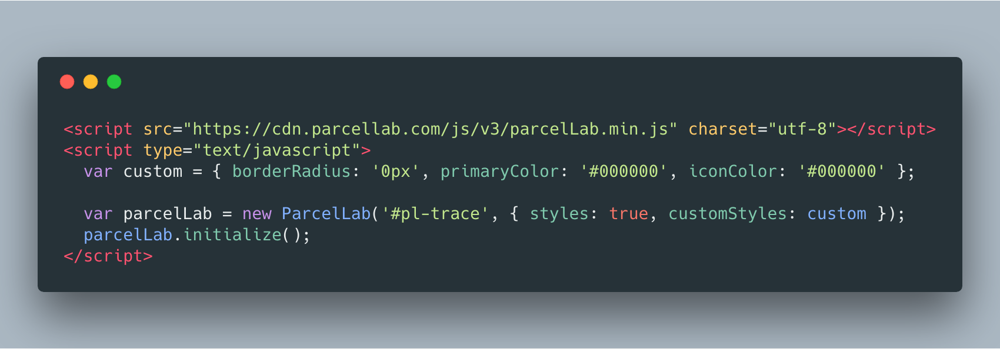

# parcelLab Javascript Plugin
JavaScript to integrate a shop frontend (or any webpage) with parcelLab. This plugin can be used to retrieve and display the checkpoints of a tracking (delivery status page), or display an estimated delivery date for a given destination and courier (delivery time prediction) — on any given webpage.

## Integrate delivery status page
### Adding to your webpage
Just add the following files (`parcelLab.min.js` and `fontawesome.min.css` and `parcelLab.min.css`) to your webpage. Then just initialize a new parcelLab object.

A recent version of these scripts is always available at the parcelLab CDN (see example below).

### Initializing the magic
After adding the script you will have a new `ParcelLab` class in your global scope. Just create a new instance, with the rootDomId as a parameter and initialize it and you are good to go!

### Example
```html
<head>
  ...
  <link href="https://cdn.parcellab.com/css/v2/parcelLab.min.css" rel="stylesheet">
  <link href="https://cdn.parcellab.com/css/font-awesome.min.css" rel="stylesheet">
</head>
<body>
  ...
  <script src="https://cdn.parcellab.com/js/v2/parcelLab.min.js" charset="utf-8"></script>
  <script type="text/javascript">
    var parcelLab = new ParcelLab('#pl-trace');
    parcelLab.initialize(); // <~ delivery status will be display to dom-elem. with id="pl-trace"
  </script>
</body>  
```

### Enabling parcelLab default styles
To enable the defaulut styles for the plugin, just add the class `parcellab-styles` to the root container (in this case `#pl-trace`) - or just simply pass `styles: true` to the options when creating a ParcelLab instance.
```html
<script type="text/javascript">
  var parcelLab = new ParcelLab('#pl-trace', { styles: true });
  parcelLab.initialize(); // <~ delivery status will be display to dom-elem. with id="pl-trace"
</script>
```

### Options
You can define options by passing an Object as second argument, when creating a new ParcelLab Object.
`new ParcelLab('#pl-trace', options)`
These are the available options:
- styles : Boolean (see above)
- customStyles : Object (see below)
- rerouteButton : 'left' | 'right' (defines where to render the reroute button if possible)
- show_searchForm :  Boolean (activates a search form, which will be rendered if tracking was not found or no trackingNo/orderNo was given, needs userId)
- userId : String (other way to pass userId - instead of in url)
- trackingNo : String (other way to pass trackingNo - instead of in url)
- orderNo : String (other way to pass orderNo - instead of in url)
- courier : String (other way to pass courier - instead of in url)
- selectedTrackingNo : String (other way to pass selectedTrackingNo - instead of in url)
- show_note : String (renders a note box on top - useful for showing important information)
- banner_image : Banner to render on the right
- banner_link : Link for banner image

All options can also be passed in via URL search query.

### Custom styling
You can customize the buttons and the boxes of the plugin by simply passing the Object 'customStyles' in the options.  
Possible customStyle options:
```javascript
options.customStyles = {
  borderColor: '#eeeeee', // sets border color for the boxes (default: #eeeeee)
  borderRadius: '4px', // sets the border radius for the boxes and buttons (default: 4px)
  buttonColor: '#333', // sets text color for buttons (default: #333)
  buttonBackground: '#e6e6e6', // sets background color for buttons (default: #e6e6e6)
  iconColor: '#000' // sets color for the status icons (default: #000)
};
```

The customStyles attr can also be passed in via URL search query (without 'customStyles' parent key).  
Just drop the '#' from hex colors.  
For example  `www.versand-status.de/?trackingNo=...&borderRadius=2px&buttonColor=e6e6e6`

#### ⚠️  If you need more customizing, use a custom stylesheet.

## Custom styling example
In this example we will set the box and button border-radius to 0px and make the buttons black.
```html
<script type="text/javascript">
  var custom = { borderRadius: '0px', buttonBackground: '#000000', buttonColor: '#fff' };

  var parcelLab = new ParcelLab('#pl-trace', { styles: true, customStyles: custom });
  parcelLab.initialize();
</script>
```

### Without action box

If you want to use the plugin in a non-customer facing website (e.g. internal page for customer support), it is recommended to hide the action box like so:

```html
<style> div#pl-action-box-container { display: none; } </style>
```

## Integrate delivery time prediction
*Please note: Delivery time prediction is currently only supported for deliveries to Germany.*

### Adding to your webpage
Same as above.

### Initializing
After adding the script, there will be a new `ParcelLabPrediction` class in the global scope. This can also just be initialized, but more options are required for the script to work. Following parameters are required to be supplied in the options object:

* `userId`: This is your shop's parcelLab user-id and is used to map the start location.
* `courier`: Here, the parcelLab courier code for the planned courier has to be specified.
* `location`: This specifies the location of the recipient in one of two ways:
  1. Using the zip code and country, in the format `<zip-code>_<country>`, where `<zip-code>` is the pure-numerical zip code, and `<country>` the [ISO 3166-1 alpha-3](https://en.wikipedia.org/wiki/ISO_3166-1_alpha-3) code of the country. For example: `80331_DEU`.
  2. The IP-Address of the visitor, e.g. `127.0.0.1`.

### Example
```html
<head>
  ...
  <link href="https://cdn.parcellab.com/css/v2/parcelLab.min.css" rel="stylesheet">
  <link href="https://cdn.parcellab.com/css/font-awesome.min.css" rel="stylesheet">
</head>
<body>
  ...
  <script src="https://cdn.parcellab.com/js/v2/parcelLab.min.js" charset="utf-8"></script>
  <script type="text/javascript">
    var prediction = new ParcelLabPrediction('#deliveryTime', {
      // required
      userId: 122,
      courier: 'dhl-germany',
      location: '94261_DEU',

      // optional
      prefix: 'Lieferzeit:', // text to display left of the prediction
      suffix: 'Werktage', // text to display right of the prediction
      offset: 1, // offset in days to add to the predicted delivery time
      infoCaption: '#infoLabel', // where to display the info caption
      language: 'de', // language in which to display the info caption in
    });
    prediction.initialize(); // <~ this display the prediction in a dom-elem with id="#deliveryTime"
  </script>
</body>  
```

## For developers
### Develop
First, make sure you `npm i serve -g`, as this package is used to locally serve compiled sources when testing.

Then:
```bash  
$ npm run start
```

Now, the resources are served on `localhost:4000`.

### Build
```bash
$ npm run build
```
Minified `parcelLab.min.js` and `parcelLab.min.css` will be in the build dir.


### Test
```bash
$ npm run test
```

### Deploy
```bash
$ npm run deploy
```

### Adding dev scripts
There are no scripts in this project. All dev cycles are maintained in the Makefile.  
Just add a target and write your commands.
