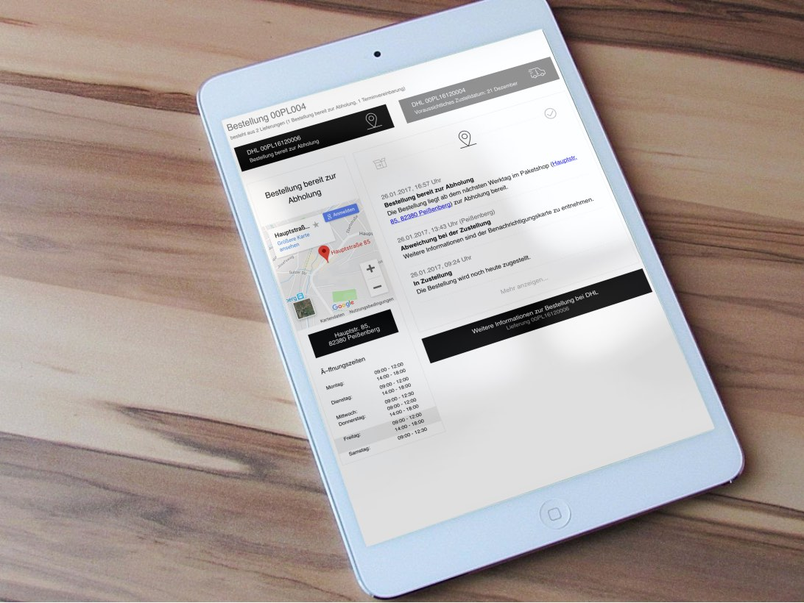

# parcelLab Javascript Plugin
Integrate parcelLab to your shop frontend (or any webpage). This plugin will fetch and display all important information of a given tracking and turn any webpage to a delivery status page.

## Integrate delivery status page

### Adding to your webpage
Just place the following snippet into the container you want the plugin to be rendered.

```html
<div id="pl-trace"></div>

<script  type="text/javascript">
  (function (prcl) {/* Load parcelLab assets ... */
    if (window.ParcelLab) {return prcl();}function a() {var styles = document.createElement('link'); styles.rel = 'stylesheet'; styles.href = 'https://cdn.parcellab.com/css/v3/parcelLab.min.css'; document.getElementsByTagName('head')[0].appendChild(styles); }function b(cb) { var script = document.createElement('script'); script.async = true; script.src = 'https://cdn.parcellab.com/js/v3/parcelLab.min.js'; (document.getElementsByTagName('head')[0] || document.getElementsByTagName('body')[0]).appendChild(script); script.onload = cb; } a(); b(prcl);
  })(function () {/* ... plugin is ready to use: */
    var options = {};
    var pl = new ParcelLab('#pl-trace', options);
    pl.initialize();
    window._prcl = pl;
  });
</script>
```

This snippet will load the needed assets and render the parcelLab plugin into the div with the id "#pl-trace". If you want the plugin to be rendered to an other DOM node you just have to change the id in the snippet. Further you can customize the plugin by extending the options object (see below).
  
#### WARNING
If your webpage does not allow post hoc insertion of assets (scripts and stylesheets), you have to add the assets manually in the `<header>` part of your webpage.  
A recent version of these scripts is always available at the parcelLab CDN:
- `<link href="https://cdn.parcellab.com/css/v3/parcelLab.min.css" rel="stylesheet">`
- `<script src="https://cdn.parcellab.com/js/v3/parcelLab.min.js" charset="utf-8"></script>`

### Options
You can define options by passing an Object as second argument, when creating a new ParcelLab Object.
```html
  <script type="text/javascript">
    ...
    var options = { rerouteButton: 'left', show_searchForm: 'true' };
    var parcelLab = new ParcelLab('#pl-trace', options);
    parcelLab.initialize();
    ...
  </script>
```

These are the available options:
- styles : Boolean (`false` will disable the default css for custom styling)
- customStyles : Object (see below)
- rerouteButton : 'left' | 'right' - default is 'right' (defines where to render the reroute button if possible)
- show_searchForm :  Boolean (activates a search form, which will be rendered if tracking was not found or no trackingNo/orderNo was given, needs userId)
- show_zipCodeInput : Boolean (activates the zip code field for the search form)
- userId : String (alternative way to pass userId - instead of in url)
- trackingNo : String (alternative way to pass trackingNo - instead of in url)
- orderNo : String (alternative way to pass orderNo - instead of in url/Activate split order OverView) 
- zip : String (alternative way to pass zip - instead of in url)
- courier : String (alternative way to pass courier - instead of in url)
- client : String (alternative way to pass courier - instead of in url)
- selectedTrackingNo : String (alternative way to pass selectedTrackingNo - instead of in url)
- show_note : String (renders a note box on top - useful for showing important information)
- onRendered : Function (the plugin will run this function whenever it (re)renders)
- icon_theme : 'xmas' | 'easter' (activates the themed icons 🎄/🐰)
- customTranslations: Object (see below)

All options can also be set via URL search query.  
Just drop the '#' from hex colors and/or encode as URI component if needed.  
`www.yourshop.com/tracking/page/path?trackingNo=xyz&courier=dhl-germany`  

### Banner

The script can render an image banner link on the right, with these option parameters:

- `banner_image` : *String* (url of image or `'instagram'` for your latest instagram posting)
- `banner_link` : *String* (url of link destination)

`banner_link` is optional if `banner_image` is `'instagram'` where it defaults to your instagram page. 

For a custom `banner_image` we recommend PNG or JPG with a ratio of `0.7 : 1`, but any other format can be chosen as well. A recommended solution is `700 x 1000 px` for optimal rendering on retina screens, with texts being at least 16px high.


⚠ *instagram banners are not enabled by default. ask our support if you want this feature.*

⚠ *instagram banners require the `u` parameter with your userId to be present*

### Custom styling
You can customize the buttons and the boxes of the plugin by simply passing the Object 'customStyles' in the options.  
Possible customStyle options:
```javascript
options.customStyles = {
  borderColor: '#eeeeee', // sets border color for the boxes (default: #eeeeee)
  borderRadius: '4px', // sets the border radius for the boxes and buttons (default: 4px)
  buttonColor: '#333', // sets text color for buttons (default: #333)
  buttonBackground: '#e6e6e6', // sets background color for buttons (default: #e6e6e6)
  iconColor: '#000', // sets color for the status icons (default: #000)
  tabIconColor: '#000', // sets color for the order tab icons (default: buttonColor #333)
  activeTabIconColor: '#000', // sets color only for the active order tab icon (default: buttonColor #333)
  actionIconColor: '#000', // sets color only for the icons of the actionbox buttons
  margin: '0px 0px', // sets mnargin for #pl-main-box (default: 0px)
};
```

The customStyles attr can also be passed in via URL search query (without 'customStyles' parent key).  
Just drop the '#' from hex colors and/or encode as URI component if needed.  
For example  `www.versand-status.de/?trackingNo=...&borderRadius=2px&buttonColor=e6e6e6`

#### ⚠️  If you need more customizing, use a custom stylesheet.

### Hook onRendered

There is another option called `onRendered` which expects a `function (state)` with `state` being an object describing the pulled information:

```javascript
var plRenderedHook = function (state) {
  // Do something with the DOM or the information
  console.log(state);
};

var parcelLab = new ParcelLab('#pl-trace', { onRendered: plRenderedHook });
parcelLab.initialize();
```

## Custom styling example
In this example we will set the box and button border-radius to 0px and make the buttons black.
```html
<script type="text/javascript">
  var custom = { borderRadius: '0px', buttonBackground: '#000000', buttonColor: '#fff' };

  var parcelLab = new ParcelLab('#pl-trace', { styles: true, customStyles: custom });
  parcelLab.initialize();
</script>
```

### Without action box

If you want to use the plugin in a non-customer facing website (e.g. internal page for customer support), it is recommended to hide the action box like so:

```html
<style> div#pl-action-box-container { display: none; } </style>
```

## Custom translations
You can change the static plugin text parts with your own translations. Therefor just add the attribute `customTranslations` to options and fill with your custom texts. You can find the full list of texts, used by the plugin [here](https://github.com/parcelLab/parcelLab-js-plugin/blob/master/src/js/lib/static.js#L253). If you don't define a language in your customTranslations, the plugin will fallback to the original text, when rendered in this language.

### Custom translations example
Lets change the texts for the search form:
```javascript
  ...
  options.customTranslations = {
    de: {
      searchOrder: 'Bestellnummer eingeben', // translation for search input placeholder
      zip: 'PLZ eingeben', // translation for zip input placeholder
      search: 'Suche starten', // translation for search button text
    },
    en: {
      searchOrder: 'Type order number',
      zip: 'Type zip code',
      search: 'Start search',
    },
  }
  var parcelLab = new ParcelLab('#pl-trace', options);
  parcelLab.initialize();
```

## Integrate delivery time prediction
*Please note: Delivery time prediction is currently only supported for deliveries to Germany.*

### Adding to your webpage
Same as above.

### Initializing
After adding the script, there will be a new `ParcelLabPrediction` class in the global scope. This can also just be initialized, but more options are required for the script to work. Following parameters are required to be supplied in the options object:

* `userId`: This is your shop's parcelLab user-id and is used to map the start location.
* `courier`: Here, the parcelLab courier code for the planned courier has to be specified.
* `location`: This specifies the location of the recipient in one of two ways:
  1. Using the zip code and country, in the format `<zip-code>_<country>`, where `<zip-code>` is the pure-numerical zip code, and `<country>` the [ISO 3166-1 alpha-3](https://en.wikipedia.org/wiki/ISO_3166-1_alpha-3) code of the country. For example: `80331_DEU`.
  2. The IP-Address of the visitor, e.g. `127.0.0.1`.

### Example
```html
<head>
  ...
  <link href="https://cdn.parcellab.com/css/v2/parcelLab.min.css" rel="stylesheet">
  <link href="https://cdn.parcellab.com/css/font-awesome.min.css" rel="stylesheet">
</head>
<body>
  ...
  <script src="https://cdn.parcellab.com/js/v2/parcelLab.min.js" charset="utf-8"></script>
  <script type="text/javascript">
    var prediction = new ParcelLabPrediction('#deliveryTime', {
      // required
      userId: 122,
      courier: 'dhl-germany',
      location: '94261_DEU',

      // optional
      prefix: 'Lieferzeit:', // text to display left of the prediction
      suffix: 'Werktage', // text to display right of the prediction
      offset: 1, // offset in days to add to the predicted delivery time
      infoCaption: '#infoLabel', // where to display the info caption
      language: 'de', // language in which to display the info caption in
    });
    prediction.initialize(); // <~ this display the prediction in a dom-elem with id="#deliveryTime"
  </script>
</body>  
```

## For developers

You will need GOOGLE_API_KEY for running the application locally. Andrej Fritz can provide it to you.
### Develop
```bash  
$ npm install
$ npm run start
```

Now, the test page is served on `localhost:4000`.

### Build
```bash
$ npm run build
```
Minified `index.js` and `index.css` will be in the `dist` dir.

### Deploy
```bash
$ npm run deploy
```
The `index.js`and `index.css`files will be deployed as parcelLab.min.js and parcelLab.min.css on the CDN.
